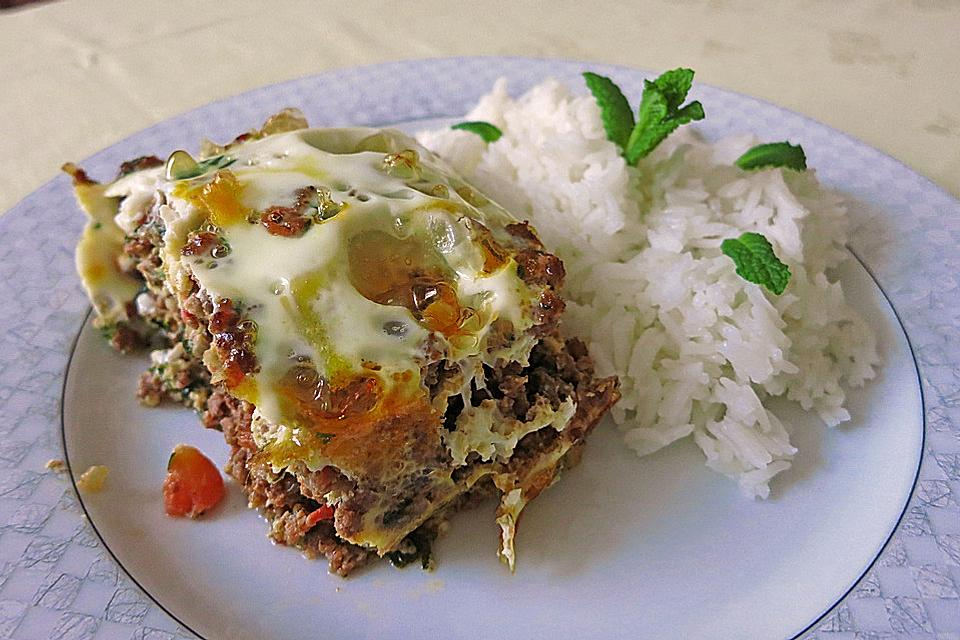
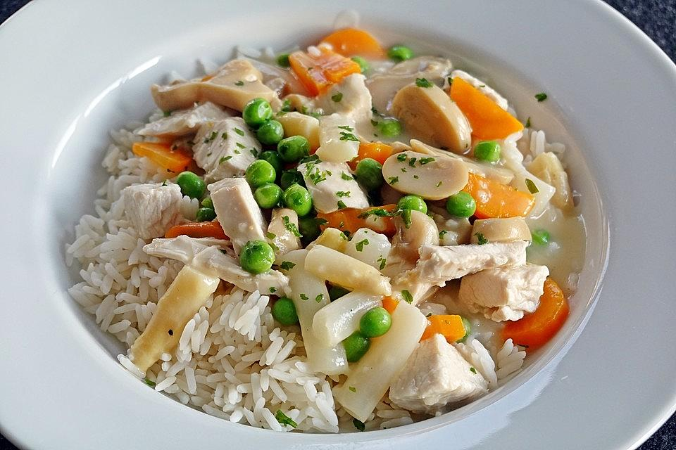

# rezepte-imadteryaki

#### Syrische Fleischpastete
| Zutat          | Mange    | 
|----------------|----------|
| Öl             | 4 EL     |
|Gehacktes (Rind)| 500g     |
|Zwiebel         | 1        |
|Knoblauchzehe   | 2        |
|Tomaten         | 4        |
|Petersilie      |1/2 Bund  |
|Kümmel          | 1/2 TL   |
|Minze           | 6 Blätter|
|Eier            | 4        |
|Salz            | 1 LT     |
|Pfefer          | 1/2 LT   |

##### Zubereiten :
1.Öl in einer großen Pfanne erhitzen. Gehacktes unter Rühren ca. 5 Minuten darin bräunen. Gehackte Zwiebeln und gehackte Knoblauchzehen dazugeben. Salzen und pfeffern und bei geringer Hitze schmoren.
Tomaten mit kochend heißem Wasser übergießen. Die Haut abziehen und die Tomaten würfeln, dabei die Stielansätze wegschneiden. Tomatenwürfel sowie die gehackte Petersilie, den Kümmel, die gehackten Minzeblätter bzw. den gehackten Dill zum Fleisch geben. Danach noch alles ca. 10 Minuten schoren lassen.
2. Feuerfeste Form mit Margarine einfetten und die Fleischmasse einfüllen. Die Eier verquirlen und darüber gießen. Form auf die mittlere Schiene in den vorgeheizten Ofen (Ober-/Unterhitze: 175°C, Gas: Stufe 2) stellen und 20 Minuten garen lassen.

 Dazu passt Tomatensauce, Kopfsalat mit viel Kräutern und Reis als Beilage. Als Getränk passt Bier.

#### Hühnerfrikassee
| Zutat           | Mange     | 
|-----------------|-----------|
| Barthänchen     | 1         |
|Zitronensaft     | 1 Spritzer|
|Zwiebel          | 1         |
|Sahne            | 1/2 Beche |
|Tomaten          | 2         |
|Speagelstück     | 1 Dose    |
|Erbsen und Möhren| 6 Blätter |
|Eigelb           | 2         |
|Salz             | 2 LT      |
|Pfefer           | n. B.     |
|Champignons      | 1 Glas    |
| Mehl            | etwas     |
|Margarine        | n. B.     |

##### Zubereiten :

1. Das Hähnchen salzen und in einen Topf geben. Diesen dann bis zu 3/4 mit Wasser füllen. Die Zwiebel schälen und vierteln. Die Tomaten waschen und klein schneiden. Zwiebeln und Tomaten dazugeben. Zwei TL Salz und Pfeffer in das Wasser geben. Zum Kochen bringen und köcheln lassen, bis das Fleisch gar ist, das dauert ca. 40 - 60 Minuten bei einem Brathähnchen und mindestens 2 Stunden bei einem Suppenhuhn. Ob das Huhn gar ist, kannst du prüfen, indem du an einem Schenkel ziehst, er muss sich dann leicht lösen.
2. Wenn das Hähnchen gar gekocht ist, aus dem Topf nehmen und abkühlen lassen. Die entstandene Brühe durch ein Sieb gießen. Das Hähnchenfleisch von den Knochen lösen.
3. Margarine in den Topf geben und erhitzen, das Mehl nun unter schnellem Rühren hinzufügen. Nun die Geflügelbrühe in die Mehlschwitze geben. Erst ein bisschen - um die Brühe mit der Schwitze zu verbinden und um Klümpchen zu vermeiden - und dann die restliche Brühe hineingießen (die Brühe wird darauf etwas dickflüssig). Ca. 10 Minuten unter häufigem Rühren köcheln lassen und mit Salz, Zitronensaft und Pfeffer abschmecken. Zwei Eigelb mit der Sahne verrühren und zugeben. Nun das Hähnchenfleisch mit den Champignons, den Erbsen und Möhren sowie dem Spargel hinzufügen und alles nur noch heiß werden lassen. Heiß servieren

Tipp: Anstatt eines kompletten Hähnchens kann man auch Hühnerschenkel für das Frikassee nehmen.

